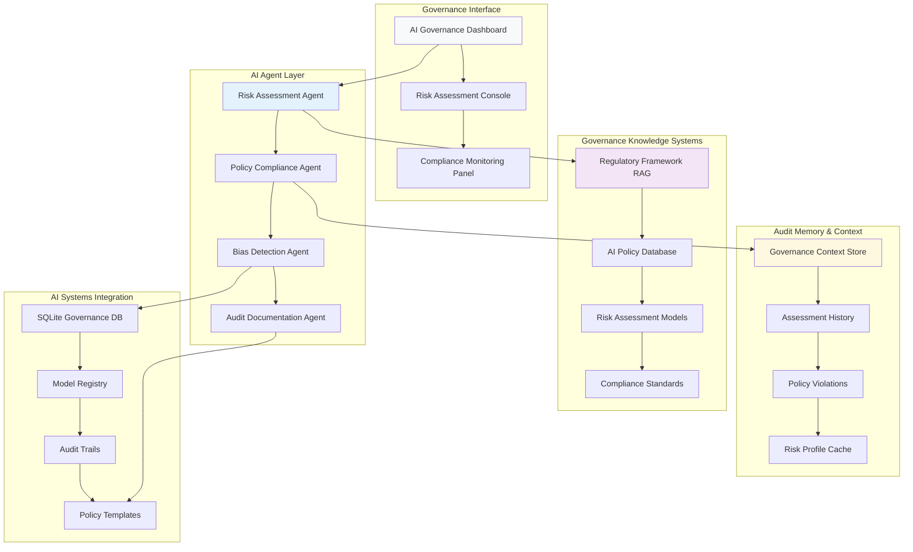
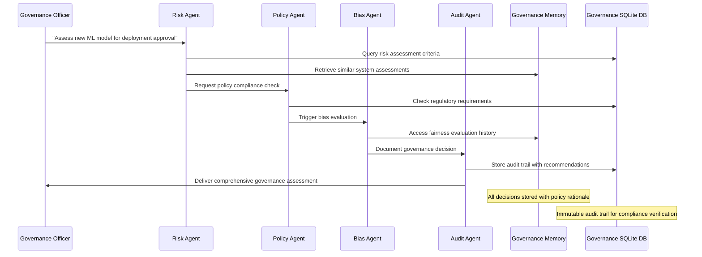
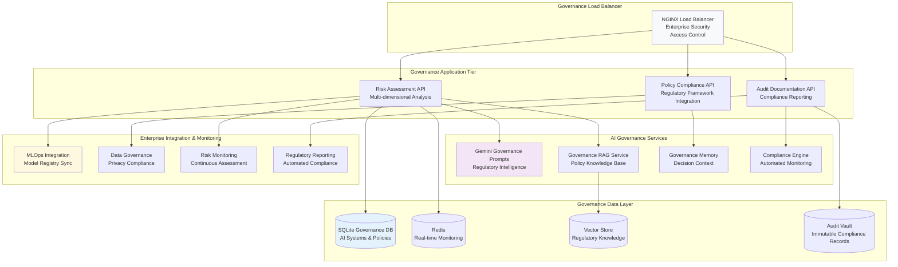

# AI Governance Pod: Enterprise AI Audit Platform
## Project Overview - Building the Future of AI Risk Management

**Mission**: Create an AI-powered governance platform that automates compliance, manages risk, and ensures ethical AI deployment across enterprise systems.

**Industry Context**: AI governance market growing from $227M in 2024 to projected $4.83B by 2034. 78% of organizations use AI, but most lack comprehensive governance frameworks.

---

## Learning Objectives

By the end of 4 hours, each pair will have built and deployed:
- Multi-agent AI governance system with automated risk assessment
- RAG-powered policy compliance platform with regulatory knowledge
- Context-aware audit conversations with persistent governance memory
- Production deployment with enterprise-grade monitoring and compliance automation

---

## System Architecture



---

## User Stories & Success Criteria

### As a Chief Risk Officer
| User Story | Acceptance Criteria | Technical Implementation |
|------------|-------------------|-------------------------|
| **AI Risk Assessment** | "I can evaluate enterprise AI systems for governance risks and get comprehensive risk scores" | Multi-agent assessment with bias detection + compliance checking |
| **Regulatory Compliance** | "I receive automated compliance reports for EU AI Act, NIST frameworks, and internal policies" | Policy compliance agent with regulatory knowledge RAG |
| **Risk Monitoring** | "I get real-time alerts when AI systems drift from approved parameters or violate policies" | Continuous monitoring with automated risk detection |
| **Audit Documentation** | "I can generate audit-ready documentation for all AI systems and governance decisions" | Audit agent with automated report generation + evidence collection |

### As a Data Science Team Lead
| User Story | Acceptance Criteria | Technical Implementation |
|------------|-------------------|-------------------------|
| **Governance Guidance** | "I can check if my AI models comply with company policies before deployment" | Pre-deployment governance screening with policy matching |
| **Risk Mitigation** | "I receive specific recommendations for reducing identified governance risks" | Risk assessment with actionable mitigation strategies |
| **Policy Understanding** | "I get clear explanations of governance requirements in technical terms" | Plain-language policy translation for technical teams |

### As a Compliance Auditor
| User Story | Acceptance Criteria | Technical Implementation |
|------------|-------------------|-------------------------|
| **Audit Trail Verification** | "I can trace all AI decisions and verify governance controls are operating effectively" | Immutable audit logging + governance control verification |
| **Regulatory Reporting** | "I can generate reports demonstrating compliance with applicable AI regulations" | Automated compliance reporting with regulatory mapping |

---

## What You'll Receive (Instructor-Provided Foundation)

### Starter Kit Contents

#### Backend Infrastructure (`/backend`)
```python
# Flask API with governance data integration
├── app.py                          # Main Flask application
├── models/
│   ├── ai_system.py               # AI system registry and metadata
│   ├── risk_assessment.py         # Risk scoring and evaluation
│   ├── policy.py                  # Governance policy models
│   └── audit_trail.py             # Compliance audit tracking
├── agents/
│   ├── risk_agent.py              # AI risk assessment and scoring
│   ├── policy_agent.py            # Policy compliance checking
│   ├── bias_agent.py              # Bias detection and analysis
│   └── audit_agent.py             # Audit documentation generation
└── database/
    ├── governance_data.db         # Pre-populated SQLite database
    ├── schema.sql                 # Database structure
    └── seed_data.sql              # Sample governance data
```

#### Frontend Components (`/frontend`)
```javascript
// React components for governance platform
├── src/
│   ├── components/
│   │   ├── GovernanceOverview.jsx     # AI governance dashboard
│   │   ├── RiskAssessment.jsx         # Risk evaluation interface
│   │   ├── PolicyCompliance.jsx       # Compliance monitoring
│   │   ├── BiasAnalysis.jsx           # Bias detection dashboard
│   │   └── AuditReporting.jsx         # Audit documentation
│   ├── services/
│   │   ├── governanceAPI.js           # Governance system integration
│   │   ├── riskAPI.js                 # Risk assessment services
│   │   └── auditAPI.js                # Audit trail management
│   └── utils/
│       ├── riskCalculations.js        # Risk scoring algorithms
│       └── complianceUtils.js         # Compliance checking utilities
```

#### SQLite Governance Database Structure

| Table | Contents | Sample Size |
|-------|----------|------------|
| **ai_systems** | Registered AI models, applications, and systems | 200 enterprise AI systems |
| **risk_assessments** | Historical risk evaluations and scores | 1,000 assessment records |
| **policies** | Governance policies, standards, and frameworks | 150 policy documents |
| **compliance_checks** | Automated compliance verification results | 2,000 compliance evaluations |
| **audit_events** | Governance decisions and audit trail | 5,000 audit entries |
| **bias_evaluations** | Bias detection results and remediation | 500 bias assessments |
| **regulatory_frameworks** | EU AI Act, NIST, ISO standards | 50 regulatory requirements |

```sql
-- Sample schema excerpt
CREATE TABLE ai_systems (
    system_id TEXT PRIMARY KEY,
    system_name TEXT NOT NULL,
    system_type TEXT,
    risk_category TEXT,
    deployment_status TEXT,
    owner_team TEXT,
    last_assessment_date DATE,
    governance_score REAL
);

CREATE TABLE risk_assessments (
    assessment_id TEXT PRIMARY KEY,
    system_id TEXT,
    assessment_date DATE,
    risk_score REAL,
    risk_factors TEXT,
    mitigation_recommendations TEXT,
    assessor_id TEXT
);
```

#### AI Agent Framework
```python
# Pre-built agent classes for governance
class RiskAssessmentAgent:
    """Evaluates AI systems for governance risks"""
    - Automated risk scoring across multiple dimensions
    - Bias detection and fairness evaluation
    - Data privacy and security assessment
    - Model explainability and transparency analysis

class PolicyComplianceAgent:
    """Ensures AI systems comply with governance policies"""
    - Regulatory framework mapping (EU AI Act, NIST)
    - Internal policy compliance checking
    - Automated policy recommendation generation
    - Compliance gap identification

class BiasDetectionAgent:
    """Detects and analyzes bias in AI systems"""
    - Statistical bias analysis across protected groups
    - Fairness metric calculation and monitoring
    - Bias mitigation strategy recommendations
    - Continuous bias monitoring and alerting

class AuditDocumentationAgent:
    """Generates comprehensive governance documentation"""
    - Automated audit report generation
    - Evidence collection and organization
    - Compliance certification support
    - Risk communication and stakeholder reporting
```

---

## 4-Hour Implementation Sprint

### Phase 1: Setup & Basic Governance Assessment (30 minutes)

#### Sprint Goals
- Environment setup and Gemini API integration
- Basic AI governance conversation flow
- SQLite governance database connection

#### Technical Tasks
```bash
# Quick setup checklist
1. Clone governance platform repository
2. Install dependencies: pip install -r requirements.txt && npm install
3. Initialize SQLite database: python init_governance_db.py
4. Configure Gemini API with governance prompts: python test_governance.py
5. Launch platform: npm start
```

#### AI-Assisted Development
```python
# Example: Customize the risk assessment agent
@ai_prompt_template
def governance_risk_prompt(ai_system, assessment_criteria):
    return f"""
    You are an AI governance specialist. Assess this AI system: "{ai_system}"
    
    Evaluate governance risks across:
    - Bias and fairness implications
    - Data privacy and security concerns
    - Regulatory compliance requirements (EU AI Act, NIST)
    - Explainability and transparency needs
    
    Use assessment criteria from governance database. Provide risk scores (1-10).
    Include specific mitigation recommendations and compliance requirements.
    """
```

#### Success Metrics
- Governance officer can assess AI systems and get risk evaluations
- System retrieves relevant policies from SQLite database
- Risk agent provides scored assessments with recommendations

---

### Phase 2: Policy Logic & Compliance Checking (30 minutes)

#### Sprint Goals
- Implement automated policy compliance algorithms
- Add bias detection and fairness evaluation
- Create regulatory framework mapping
- Build governance audit trail system

#### Technical Implementation
```python
# Comprehensive governance risk analyzer
class GovernanceRiskAnalyzer:
    def assess_ai_system_governance(self, ai_system, deployment_context):
        # Multi-dimensional risk assessment
        risk_dimensions = {
            'bias_fairness': self.evaluate_bias_risks(ai_system),
            'privacy_security': self.assess_privacy_compliance(ai_system),
            'explainability': self.evaluate_transparency_requirements(ai_system),
            'regulatory_compliance': self.check_regulatory_requirements(ai_system),
            'data_governance': self.assess_data_quality_governance(ai_system)
        }
        
        # Calculate weighted governance score
        governance_score = self.calculate_weighted_governance_score(risk_dimensions)
        
        return {
            'governance_score': governance_score,
            'risk_breakdown': risk_dimensions,
            'compliance_status': self.determine_compliance_status(risk_dimensions),
            'mitigation_plan': self.generate_mitigation_recommendations(risk_dimensions)
        }
```

#### Policy Compliance Engine
| Compliance Area | Assessment Method | Regulatory Basis | Automation Level |
|----------------|------------------|------------------|------------------|
| **Bias Detection** | Statistical fairness metrics | EU AI Act Article 10 | Fully automated |
| **Data Privacy** | Privacy impact assessment | GDPR + AI Act Article 14 | Semi-automated |
| **Transparency** | Explainability scoring | NIST AI RMF | Manual + automated |
| **Risk Classification** | AI system categorization | EU AI Act Annex III | Fully automated |

#### Governance Audit Framework
```python
# Comprehensive governance audit system
class GovernanceAuditLogger:
    def log_governance_decision(self, decision_context):
        audit_entry = {
            'timestamp': datetime.utcnow(),
            'system_id': decision_context['ai_system_id'],
            'decision_type': decision_context['governance_action'],
            'risk_assessment': decision_context['risk_evaluation'],
            'policy_basis': decision_context['applicable_policies'],
            'compliance_status': decision_context['compliance_determination'],
            'mitigation_actions': decision_context['required_actions'],
            'assessor_id': decision_context['responsible_party']
        }
        
        # Immutable audit trail with cryptographic integrity
        audit_hash = self.calculate_audit_hash(audit_entry)
        audit_entry['integrity_hash'] = audit_hash
        
        self.governance_audit_store.insert(audit_entry)
        
        # Generate compliance alerts if needed
        self.check_compliance_thresholds(audit_entry)
```

#### Success Metrics
- Policy compliance automatically checked against multiple frameworks
- Bias detection identifies potential fairness issues
- Audit trail captures all governance decisions with integrity verification

---

### Phase 3: RAG + Memory + Multi-Agent Governance Workflow (90 minutes)

#### Sprint Goals - Advanced Governance Intelligence
- Build comprehensive regulatory knowledge RAG system
- Implement persistent governance memory and policy context
- Create sophisticated multi-agent governance workflow
- Add real-time compliance monitoring and alerting

#### Governance RAG Implementation
```python
# Advanced governance RAG with regulatory knowledge
class GovernanceRAGSystem:
    def __init__(self):
        self.vector_store = ChromaDB(collection_name="governance_docs")
        self.sqlite_connector = SQLiteConnector("governance_data.db")
        self.governance_embeddings = SentenceTransformer('sentence-transformers/all-MiniLM-L6-v2')
        
    def hybrid_governance_search(self, query, governance_context):
        # Combine regulatory frameworks + internal policies + best practices
        regulatory_results = self.search_regulatory_frameworks(query)
        policy_results = self.search_internal_policies(query)
        assessment_results = self.search_risk_assessments(query, governance_context)
        best_practice_results = self.search_governance_best_practices(query)
        
        # Weight results based on regulatory authority and relevance
        return self.rank_governance_authority(
            regulatory_results,
            policy_results, 
            assessment_results,
            best_practice_results,
            governance_context
        )
        
    def generate_governance_analysis(self, results, ai_system_context):
        # AI synthesis of governance requirements
        context = f"""
        Regulatory Requirements: {results['regulatory']}
        Internal Policies: {results['policies']}
        Risk Assessments: {results['assessments']}
        AI System Context: {ai_system_context}
        """
        
        return self.gemini_client.generate_governance_analysis(context)
```

#### Multi-Agent Governance Workflow


#### Advanced Governance Memory Architecture
Enterprise AI governance platforms are emerging as the central nervous system for AI operations, automating compliance and managing risk.

| Memory Type | Storage Method | Governance Use Case | Retention Period |
|-------------|----------------|-------------------|------------------|
| **Policy Context** | Vector embeddings of governance decisions | Policy interpretation, precedent setting | Permanent |
| **Risk History** | Knowledge graph of system relationships | Risk pattern recognition, trend analysis | 7 years (regulatory) |
| **Assessment Patterns** | Evaluation methodology tracking | Consistent assessment application | 5 years |
| **Compliance State** | Real-time governance status | Continuous monitoring, alerts | Current + 3 years |

```python
# Governance memory with policy context
class GovernanceMemoryManager:
    def store_governance_decision(self, system_id, governance_decision):
        # Store governance precedent with policy rationale
        governance_context = self.encrypt_governance_data(governance_decision)
        
        # Store episodic governance memory
        self.governance_store.add_decision(system_id, governance_context)
        
        # Update policy interpretation knowledge
        policy_patterns = self.extract_policy_interpretation_patterns(governance_decision)
        self.policy_interpretation_graph.update_precedents(system_id, policy_patterns)
        
        # Learn risk assessment patterns
        risk_patterns = self.analyze_risk_assessment_patterns(governance_decision)
        self.risk_pattern_store.update(system_id, risk_patterns)
        
    def get_governance_context(self, system_id, current_assessment):
        return {
            'assessment_history': self.governance_store.get_relevant_assessments(
                system_id, current_assessment
            ),
            'policy_precedents': self.policy_interpretation_graph.get_similar_decisions(system_id),
            'risk_patterns': self.risk_pattern_store.get_assessment_patterns(system_id)
        }
```

#### Real-Time Governance Monitoring
```python
# Continuous governance monitoring with automated alerts
class GovernanceMonitoringEngine:
    def monitor_ai_system_governance(self, system_id, monitoring_parameters):
        monitoring_data = {
            'bias_drift': self.detect_bias_drift(system_id),
            'performance_degradation': self.monitor_model_performance(system_id),
            'policy_violations': self.check_ongoing_policy_compliance(system_id),
            'regulatory_changes': self.monitor_regulatory_updates(monitoring_parameters),
            'risk_threshold_breaches': self.evaluate_risk_thresholds(system_id)
        }
        
        # AI analysis of governance status
        governance_status = self.synthesize_governance_monitoring(monitoring_data)
        
        return {
            'governance_health': monitoring_data,
            'ai_analysis': governance_status,
            'recommended_actions': self.generate_governance_actions(monitoring_data)
        }
```

#### Success Metrics
- Multi-agent system provides comprehensive governance analysis
- Governance memory enables consistent policy interpretation
- RAG system retrieves relevant regulatory requirements and precedents

---

### Phase 4: Production Deployment & Enterprise Governance Integration (90 minutes)

#### Sprint Goals - Enterprise Governance Platform
- Implement enterprise-grade governance security
- Deploy with comprehensive compliance automation
- Add regulatory reporting and audit capabilities
- Create production-ready governance monitoring system

#### Enterprise Governance Security Framework
```python
# Enterprise governance security and compliance
class EnterpriseGovernanceManager:
    def __init__(self):
        self.access_controller = GovernanceAccessControl()
        self.audit_system = ImmutableAuditLogger()
        self.compliance_engine = RegulatoryComplianceEngine()
        self.risk_monitor = ContinuousRiskMonitor()
        
    def secure_governance_operation(self, operation, user_context):
        # Verify governance access permissions
        access_granted = self.access_controller.verify_governance_access(
            user_context['user_id'], 
            user_context['role'], 
            operation['governance_scope']
        )
        
        if access_granted:
            # Execute governance operation with full audit trail
            operation_result = self.execute_governance_operation(operation)
            
            # Log for compliance and audit
            self.audit_system.log_governance_operation(
                user_id=user_context['user_id'],
                operation_type=operation['type'],
                ai_systems_affected=operation['scope'],
                governance_decision=operation_result,
                compliance_basis=operation_result['regulatory_basis'],
                timestamp=datetime.utcnow()
            )
            
            return operation_result
        
        raise GovernanceAccessDeniedError("Insufficient governance permissions")
```

#### Regulatory Compliance Automation
AI governance market projected to grow from $227M in 2024 to $4.83B by 2034, driven by evolving regulations like the EU AI Act.

```python
# Automated regulatory compliance monitoring
class RegulatoryComplianceEngine:
    def __init__(self):
        self.regulatory_frameworks = {
            'EU_AI_Act': EUAIActComplianceChecker(),
            'NIST_AI_RMF': NISTAIRiskFrameworkChecker(),
            'ISO_42001': ISOAIManagementSystemChecker(),
            'GDPR_AI': GDPRAIComplianceChecker()
        }
        
    def assess_comprehensive_compliance(self, ai_system_portfolio):
        compliance_results = {}
        
        for framework_name, checker in self.regulatory_frameworks.items():
            framework_results = {
                'overall_compliance': checker.assess_portfolio_compliance(ai_system_portfolio),
                'system_specific_results': checker.assess_individual_systems(ai_system_portfolio),
                'gap_analysis': checker.identify_compliance_gaps(ai_system_portfolio),
                'remediation_plan': checker.generate_remediation_recommendations(ai_system_portfolio)
            }
            compliance_results[framework_name] = framework_results
            
        return {
            'compliance_summary': compliance_results,
            'enterprise_risk_score': self.calculate_enterprise_governance_risk(compliance_results),
            'priority_actions': self.prioritize_compliance_actions(compliance_results)
        }
```

#### Production Architecture for Enterprise Governance


#### Cost Optimization for Governance Platform
| Cost Center | Optimization Strategy | Expected Savings |
|-------------|----------------------|------------------|
| **Gemini API Calls** | Smart caching + governance prompt optimization | 65% reduction |
| **Compliance Monitoring** | Efficient assessment scheduling + delta checking | 50% reduction |
| **Audit Storage** | Intelligent archiving + compression | 40% reduction |
| **Risk Calculations** | Incremental updates + cached assessments | 45% reduction |

#### Comprehensive Governance Audit Framework
```python
# Enterprise governance audit and reporting
class EnterpriseGovernanceAuditor:
    def __init__(self):
        self.compliance_frameworks = ComplianceFrameworkRegistry()
        self.audit_evidence_collector = AuditEvidenceCollector()
        self.reporting_engine = GovernanceReportingEngine()
        
    def conduct_comprehensive_governance_audit(self, audit_scope):
        audit_results = {
            'ai_system_inventory': self.audit_ai_system_governance(audit_scope),
            'policy_compliance': self.audit_policy_compliance(audit_scope),
            'risk_management': self.audit_risk_management_effectiveness(audit_scope),
            'bias_fairness': self.audit_bias_detection_controls(audit_scope),
            'regulatory_compliance': self.audit_regulatory_adherence(audit_scope),
            'governance_processes': self.audit_governance_process_maturity(audit_scope)
        }
        
        # Generate comprehensive governance score
        governance_maturity = self.calculate_governance_maturity_score(audit_results)
        recommendations = self.generate_governance_improvement_plan(audit_results)
        
        return {
            'governance_maturity': governance_maturity,
            'detailed_findings': audit_results,
            'improvement_recommendations': recommendations,
            'regulatory_readiness': self.assess_regulatory_readiness(audit_results)
        }
```

#### Production Readiness Checklist
- Enterprise-grade access control and governance permissions
- Automated regulatory compliance monitoring and reporting
- Immutable audit trails with cryptographic integrity
- Real-time risk monitoring with automated alerting
- Integration with enterprise MLOps and data governance systems
- Comprehensive governance documentation and evidence collection

---

## Final Demo Requirements

### Enterprise Governance Platform Showcase

Each pair must demonstrate a complete governance workflow:

1. **AI System Risk Assessment** (2 minutes)
   - Natural language governance query
   - Multi-agent risk evaluation coordination
   - SQLite governance database integration with policy compliance

2. **Compliance Monitoring Process** (2 minutes)
   - Automated policy compliance checking
   - RAG-powered regulatory requirement analysis
   - Real-time governance risk detection and alerting

3. **Production Capabilities** (1 minute)
   - Enterprise governance security features
   - Automated compliance reporting and audit trails
   - Integration with enterprise AI systems and monitoring

### Evaluation Criteria

| Metric Category | Target | Measurement Method |
|----------------|--------|-------------------|
| **Technical Excellence** | All 4 pillars operational | Live functionality demonstration |
| **Governance Accuracy** | Proper risk assessment and policy compliance | Governance professional review |
| **Regulatory Compliance** | Automated compliance verification | Regulatory framework validation |
| **Enterprise Integration** | Scalable governance automation | System integration verification |
| **Innovation Factor** | Advanced governance capabilities | Peer and instructor evaluation |

---

## Bonus Challenges (For Advanced Pairs)

### Advanced Governance Features
- **AI Model Explainability**: Automated generation of model interpretability reports
- **Continuous Bias Monitoring**: Real-time fairness metric tracking with drift detection
- **Multi-Stakeholder Governance**: Collaborative governance workflows with role-based permissions
- **Predictive Risk Assessment**: Machine learning models for governance risk forecasting

### Innovation Opportunities
Enterprise AI governance platforms are becoming the central nervous system for AI operations, automating compliance and risk management.

Consider implementing cutting-edge governance AI:
- **Governance Knowledge Graphs**: Interconnected policy and regulatory relationship mapping
- **Automated Policy Generation**: AI-assisted governance policy drafting based on regulatory requirements
- **Cross-System Risk Correlation**: Enterprise-wide AI risk pattern detection and analysis
- **Regulatory Change Impact Analysis**: Automated assessment of regulatory updates on existing AI systems

---

## Resources & Documentation

### Essential Links
- **SQLite Governance Database**: Pre-populated with AI systems, policies, and compliance frameworks
- **Gemini Governance Prompts**: Specialized templates for risk assessment and compliance analysis
- **Regulatory Framework Guide**: EU AI Act, NIST AI RMF, and ISO 42001 implementation guidelines
- **Enterprise Integration**: MLOps, data governance, and audit system integration documentation

### Getting Help
- **Technical Issues**: Instructor assistance for governance system integration
- **Regulatory Questions**: Compliance framework interpretation and implementation guidance
- **Risk Assessment**: Methodology guidance for comprehensive AI risk evaluation
- **Audit Documentation**: Best practices for governance audit trail and evidence collection

---

## Project Impact & Career Opportunities

This AI governance project reflects real industry implementations where organizations need comprehensive governance frameworks to manage AI risks and ensure regulatory compliance in an evolving regulatory landscape.

By completing this sprint, you'll have built enterprise-grade governance technology comparable to platforms used by major organizations, positioning you for high-growth roles in the rapidly expanding AI governance market.

**Ready to build the infrastructure of trust for enterprise AI? Let's create the future of AI governance.**